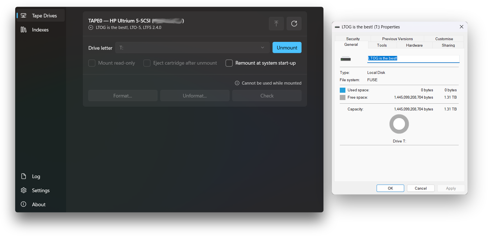

<p align="center">
   <a href="https://github.com/rlaphoenix/LTOG">LTOG</a>
  <br/>
  <sup><em>Modern LTO Tape Manager with <a href="https://www.lto.org/ltfs/">LTFS 2.4</a> and <a href="https://github.com/winfsp/winfsp">WinFsp-based tape mounting</a></em></sup>
</p>

<p align="center">
  <a href="https://github.com/rlaphoenix/LTOG/blob/main/LICENSE">
    
  </a>
  
  <a href="https://dotnet.microsoft.com">
    
  </a>
  
  <a href="https://winfsp.dev">
    
  </a>
</p>



> [!CAUTION]
> This is a new project. Please test your tape cartridge with the physical Write-Protection switch
> enabled. I highly recommend test writing on a fresh tape before using your important tapes. Extra
> caution is advised for use on tapes already formatted with LTFS versions newer or older than `2.4`.

## Features

- 🖥️ Native WinUI 3 GUI
- 📼 LTO-5+ Support
- 🗂️ LTFS 2.4.0 Support
- 💽 Virtual Drive Mounting
- 💾 Automatic Index Backup
- 🔒 Honors Write-Protection and Read-Only
- 🛡️ WHQL-signed Drivers
- ❤️ Forever FLOSS (GPLv3)

## Requirements

- Windows 10/11 x64 (32-bit is not supported)
- An LTO Generation 5 or newer tape drive
- An LTO Generation 5 or newer tape cartridge
- Drivers Installed for your LTO tape drive

A HPE-branded LTO tape drive is recommended, purely because it's the only company
who seemingly has any kind of support for use on Windows at all. It is unknown if
any other brand's drivers are properly supported.

This project cannot reliably or safely install LTO tape drivers for you, nor can
I point you in any particular direction, you will need to traverse waters far and
wide to find your drivers. Good luck soldier.

## Comparison to HPE StoreOpen

For most people this project can be considered a drop-in replacement for the entire
HPE StoreOpen Suite of LTFS-related Software. See below for a list of differences or
features not yet available. HPE's LTT (Library & Tape Tools) is still recommended.

The main reason this project was created is that as of August 2025, Windows 11 had
a change with driver signature policies, preventing the use of older kinds of driver
signatures. It came into full enforcement in June 2026 (with caveats) causing the
fuse driver for FUSE4Win to be completely unusable. Without this driver it is not
possible to mount the cartridge as a drive.

| Technology/Version                | HPE StoreOpen | LTOG           |
| --------------------------------- | ------------- | -------------- |
| HPE's LTFS Windows Patches Build  | 3.6.0         | 3.4.2          |
| LTFS Format Specification version | 2.4.0         | 2.4.0          |
| Fuse/Mounting Layer Technology    | FUSE4Win      | WinFsp 2.1     |
| Fuse/Mounting Layer Status        | Abandoned     | Maintained     |
| Driver Stack Signature Status     | Unsigned      | WHQL-certified |
| Secure Boot Support               | None          | Full support   |
| Availability                      | Complicated   | FOSS, GPLv3    |

The following features from HPE StoreOpen are not yet implemented:

- The 'Drive' field of the mapping/mounting configuration (as it is unclear what
  it does)
- 'Offline' mode for mounted files to disable thumbnails for better performance
  (as WinFsp does not seem to support it)
- Requesting mount-time override of formatted configuration (might be possible,
  havent investigated)
- Allowing files to be placed in index partition given a specific file size and/or
  file name (might be possible, havent investigated)
- Append Only Mode which may or may not be supported by all drives (might be possible,
  havent investigated)
- Advanced `ltfsck` recovery/rollback options and `mkltfs --wipe` are not
  exposed in the GUI (basic Format, Unformat and Check are implemented)
- Possibly missing obscure features I don't know about that are not advertised
  in the HPE StoreOpen GUIs...

And finally, mounting works slightly differently in this project. You must have a
valid tape cartridge inserted with LTFS format to be able to mount. In HPE's software
it lets you mount more-so the 'tape drive' instead of the tape cartridge, so you could
eject, re-insert, or change cartridge all without having to unmount/remount the tape
drive. Unfortunately, this is not seemingly possible with WinFsp, at least I can't
figure out a clean reliable way to.

## Building

First clone the repository with submodules:

```shell
git clone --recurse-submodules https://github.com/rlaphoenix/LTOG
cd LTOG
```

Then build both the LTFS, WinFsp patches, and the GUI with `.\build`.
Instructions below show how to individually build each part of the project.
The LTFS/WinFsp step only needs to be done once.

### 1. LTFS + WinFsp

In an MSYS2 MINGW64 shell:

```shell
./scripts/setup.sh    # deps via pacman, stage WinFsp, patch submodule, configure
./scripts/build.sh    # compile + stage everything into dist/
```

`dist/` should then contain the four ltfs executables, an `ltfs.conf`, runtime DLLs, and more.

### 2. GUI

Install the .NET 8 SDK:

```shell
winget install -e Microsoft.DotNet.SDK.8
```

In PowerShell:

```powershell
cd gui  # enter gui folder
dotnet build LTOG.Gui.csproj -c Release -p:Platform=x64  # build (self-contained)
robocopy "bin\x64\Release\net8.0-windows10.0.19041.0\win-x64" "..\dist\gui" /E  # self-contained output -> ..\dist
```

### 3. Installer

With `dist/` fully populated (LTFS engine + GUI), build the Windows installer:

```powershell
pwsh -ExecutionPolicy Bypass -File installer\build-installer.ps1
```

It fetches what it needs and writes `setup.exe` to `installer\Output\`.

### Testing without a Tape Drive

The file-emulator backend stores "tape blocks" in a directory:

```powershell
mkdir faketape  # create folder
.\mkltfs.exe -i .\ltfs.conf -e file -d C:/path/to/faketape -s TEST01 -n DEMO  # make a 'fake' tape drive inside
.\ltfs.exe T: -f -o config_file=C:/path/to/dist/ltfs.conf `  # mount it
    -o tape_backend=file -o devname=C:/path/to/faketape -o sync_type=close
```

## Index backups

Every mount and unmount captures the current index XML to
`C:\tmp\ltfs\<barcode-or-uuid>.schema`, the same safety net HP's product
provided. (The cartridge label shown in the GUI and in Explorer does not come
from these files; it is read directly from the cartridge memory chip before
mounting and handed to WinFsp as the real volume label via `-o volname`.)

## Repository layout

| Path               | Content                                                                                       |
| ------------------ | --------------------------------------------------------------------------------------------- |
| `third_party/ltfs` | git submodule: pristine upstream LTFS source (HPE StoreOpen 3.4.2 tree, nix-community mirror) |
| `patches/`         | the WinFsp port as a patch series applied onto the submodule                                  |
| `scripts/`         | `setup.sh` (deps, WinFsp staging, patching, configure) and `build.sh` (compile + dist)        |
| `pc/`              | pkg-config shims: `fuse` → WinFsp, `uuid` → rpcrt4, `icu` → icu-uc/icu-i18n                   |
| `gui/`             | LTOG.Gui, WinUI 3 configuration app (the primary interface)                                   |
| `installer/`       | Inno Setup script + build helper for the Windows installer                                    |
| `licenses/`        | full license texts for bundled third-party components (see `THIRD-PARTY-NOTICES.md`)           |
| `docs/`            | porting analysis & engineering log                                                            |

## Implementation Details

As HPE StoreOpen's `UMFSDK.sys` kernel driver is now refused to load on boot as
of June 2026, which is used by FUSE4Win, the only other option was to jump ship
and move from FUSE4Win to another fuse technology, so I went with WinFsp.

The LTFS format engine (`libltfs`) is open source and was already compiled against
the standard FUSE 2.x API. [WinFsp](https://winfsp.dev) provides that same FUSE API
backed by its Microsoft-signed `winfsp.sys`. So using WinFsp felt like the easiest
path, with minimal changes, has a fully signed WHQL-certified driver, and a long
standing maintained and mature codebase.

This was developed and tested on a HPE LTO-5 Ultrium 3000 (external) model
using the latest HPE driver (v4.8.0.0, cp065495) and firmware (v4.2.0.0, cp031432).
All testing has been done with secure boot enabled, latest stable version of Windows 11,
all usual driver enforcement active/unchanged, and memory core integrity enabled.

The following software is compiled from source and used from the GUI:

- `ltfs` (mount)
- `mkltfs` (format)
- `unltfs` (unformat)
- `ltfsck` (check/recover)

Port and WinFsp linking process:

1. Mapped every FUSE symbol LTFS uses against WinFsp's FUSE-compatible headers.
   Result: all 32 filesystem operations supported; the only proprietary surface
   was two FUSE4Win functions in one backend file, both with existing Win32
   fallbacks.
2. WinFsp ABI types at the FUSE boundary (`fuse_stat`, `fuse_statvfs`,
   `fuse_timespec`; the latter is _not_ layout-compatible with MinGW's `timespec`,
   conversions are field-wise), removal of the FUSE4Win SCSI tunnel in favour
   of direct `DeviceIoControl` pass-through, extended-stat (Archive attribute)
   support, plus ~2026-toolchain fixes (winpthreads `pthread_t`, missing
   `uid_t`/`gid_t`, ICU 78 `pkgdata` options, GCC 16 strictness).
3. The 2012 MinGW + Visual Studio 2010 procedure was replaced by plain
   MSYS2/MinGW-w64 with pkg-config shims; ICU message catalogs build with modern
   `genrb`/`pkgdata`. The LTFS submodule is committed with CRLF line endings, so
   `setup.sh` normalizes the worktree to LF before applying the (LF) patch
   series. This is what lets a fresh clone build on any machine.

## Credit

This project stands almost entirely on other people's work:

- **IBM** - the original Linear Tape File System Single Drive Edition;
  `libltfs` and the core utilities are IBM Almaden Research code.
- **Hewlett-Packard / HPE** - the Windows port (StoreOpen 3.4.2) and the
  `ltotape` drive backend for HP LTO drives.
- **OSR Open Systems Resources, Inc.** - the original Windows FUSE
  integration work inside the HP tree.
- **nix-community** - for preserving HPE's LGPL LTFS source after HPE stopped
  distributing it
  ([nix-community/hpe-ltfs](https://github.com/nix-community/hpe-ltfs)).
- **Bill Zissimopoulos** - [WinFsp](https://winfsp.dev), whose excellent
  FUSE-compatible layer and properly signed driver make this whole approach
  possible.
- Assistance with porting and orchestration by Claude (Anthropic).

## Licensing

LTOG as a whole is distributed under the **GNU General Public License v3.0**
(see [LICENSE](LICENSE)).

A full per-component inventory — every redistributed binary, its license,
copyright, and corresponding source — is in
[THIRD-PARTY-NOTICES.md](THIRD-PARTY-NOTICES.md), with the license texts in
[`licenses/`](licenses/). The installer and `scripts/build.sh` ship these
alongside the binaries. In summary:

- Everything original to this repository (scripts, tooling, GUI, installer,
  documentation) is **GPL-3.0**.
- The LTFS source (submodule) is **LGPL-2.1**, © IBM, HP/HPE, OSR. The
  patches in `patches/` modify that code and are therefore offered under
  **LGPL-2.1** as well, so they remain upstreamable. (LGPL-2.1 code may be
  conveyed as part of a GPLv3 work via LGPL §3.)
- **WinFsp** is GPLv3 with a FLOSS exception, © Bill Zissimopoulos. Its
  redistributable `winfsp-x64.dll` is shipped in `dist/`, and the **installer
  bundles the official WinFsp 2.1 MSI** and runs it to install the signed kernel
  driver. The FLOSS exception is what lets the LGPL-2.1 LTFS binaries link the
  WinFsp FUSE layer. Source: <https://github.com/winfsp/winfsp> (tag `v2.1`).
- Binary `dist/` folders also contain MSYS2-built runtime DLLs: libxml2 (MIT),
  ICU (Unicode v3), GNU libiconv (LGPL-2.1), zlib (Zlib), MinGW-w64 winpthreads
  (MIT/BSD), and the GCC runtime `libgcc`/`libstdc++` (GPL-3.0 with the GCC
  Runtime Library Exception).
- The GUI (`dist/gui/`) is published **self-contained**: it bundles the **.NET 8
  runtime** (MIT) and the **Microsoft Windows App SDK / WinUI 3** runtime plus
  WebView2 (Microsoft Software License Terms). The Windows App SDK AI/ML stack
  (ONNX Runtime, DirectML, WinML) is trimmed out — LTOG uses no AI APIs.
  Nothing extra is installed separately: the WinUI 3 binaries import only the
  OS-provided Universal CRT (Windows 10 1809+), so no .NET or Visual C++
  redistributable is needed.

---

© rlaphoenix 2026
